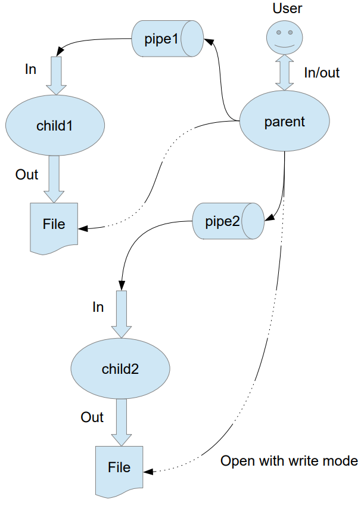

# Лабораторная работа №1

## Постановка задачи (вариант 22)

Родительский процесс создает два дочерних процесса. Первой строкой пользователь в консоль
родительского процесса вводит имя файла, которое будет использовано для открытия `File`
с таким именем на запись для `child1`. Аналогично для второй строки и процесса `child2`. 
Родительский и дочерний процесс должны быть представлены разными программами.

Родительский процесс принимает от пользователя строки произвольной длины и пересылает их в `pipe1` или в `pipe2`
в зависимости от правила фильтрации. Процесс `child1` и `child2` производят работу над строками. 
Процессы пишут результаты своей работы в стандартный вывод.

Правило фильтрации: с вероятностью 80% строки отправляются в `pipe1`, иначе в `pipe2`.
Дочерние процессы инвертируют строки.
